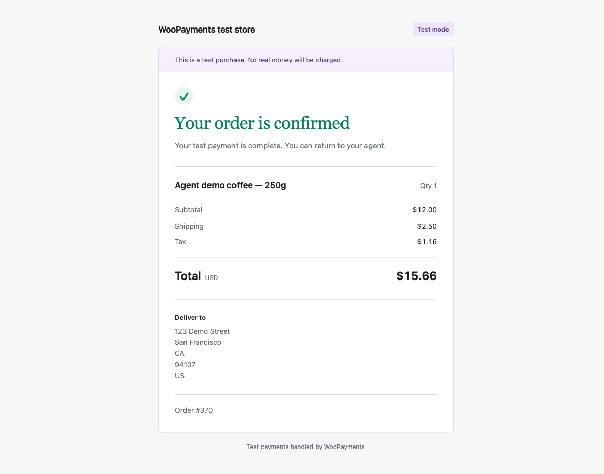

# WooPayments agent purchase demo

A native WooPayments experiment that lets an agent quote a real WooCommerce product, hand approval to the shopper in a browser, then complete a WooPayments **test** payment using the existing V1 path. The feature is disabled by default. This directory contains the local demo harness that enables and exercises it.

This is new experimental code. It is not a released WooPayments capability or an integration with an external agent payment network.

## Code ownership

The proposed feature lives in [`src/Internal/Service/AgentPurchases`](../../../src/Internal/Service/AgentPurchases): authenticated agent routes, WooCommerce quote calculation, browser-only shopper approval, order/payment state safeguards, and merchant channel controls. WooPayments loads this feature behind `wcpay_agent_purchases_experiment_enabled=yes`; with the flag absent or disabled its routes, approval page, and website visibility behavior are inactive.

`demo-support.php` is a separate **fixture adapter**, with no routes, approval UI, or merchant settings. It supplies `pm_card_visa`, validates the local V1 backend, temporarily enables tax calculation for the fixture, suppresses fixture payment emails, and restores the local Docker port in WordPress-generated links. The native feature has no fixed test payment method: without a payment-method adapter, payment completion fails closed. A production integration still needs a reviewed source of shopper-authorized payment credentials.

`setup.php` creates the disposable product, shopper, shipping and tax data, credentials, and explicitly enables the native experiment. `agent.mjs` acts as the shopper's agent through the native `/wcpay/agent-purchases/v1` API. It sends the demo shipping address; the native API does not hard-code that address.

## What we are exploring

Could a merchant enable WooPayments for purchases made by a shopper's own agent, while choosing whether to use WooPayments for website checkout too?

The merchant-adoption hypothesis is that an additional purchasing channel could be a reason to enable WooPayments. Incremental payment volume is the initial monetization hypothesis; this experiment does not establish demand, pricing, margins, or compatibility with external agent platforms.

The demo makes one interaction concrete: **agent quotes → shopper approves → agent pays → store confirms**. Feedback is especially useful on whether that feels valuable, whether the approval boundary is clear, and which missing capability would matter most for a merchant pilot.

## Try it

First complete **Install / refresh** below. This is an add-on to an existing WooPayments local development environment, not a standalone store installer. The expected merchant store is http://localhost:8082; keep both the merchant and V1 server environments running.

From `dev/experiments/agent-purchase-demo`:

```sh
node agent.mjs search coffee
node agent.mjs quote PRODUCT_ID
# Use the product ID returned by search, not a hard-coded example ID.
# Open the approval_url returned above and approve as the demo shopper.
node agent.mjs status QUOTE_ID
node agent.mjs complete QUOTE_ID
```

Codex can execute these commands as the shopper's agent. Ask it to buy the demo coffee; it should return the approval link, wait for your approval, then complete. Approval expires after ten minutes. Approval alone does not charge; the agent must subsequently complete. The agent has no approve command or approval API.

The dedicated shopper account is `agent_demo_shopper`. Its local login is stored in `.runtime/shopper.json`. The agent credential is separately stored in `.runtime/agent.json`; it cannot approve a purchase through the API. These are demo credentials, not production credentials. Do not publish them or copy `.runtime` into the WordPress web directory. This local process separation is not a sandbox against an operator who can read both credential files.

Each quote uses the dedicated test shipping address in San Francisco, one marked physical product, quantity 1–5, and a maximum $100 USD. Quantity 1: $12.00 + $2.50 delivery + $1.16 test tax = **$15.66**. Tax is calculated by WooCommerce under a scoped demo setting; global store taxes are not enabled. This fixture's tax rate is test data, not tax advice.

## Merchant control

WordPress admin → WooCommerce → Agent purchases exposes independent agent-purchase and website-visibility switches. The website switch hides WooPayments from available website gateways; the gateway's underlying enabled setting is not changed. Another configured website gateway can remain available. The demo installer enables the experiment and initializes both channel switches to on; WooPayments itself leaves the experiment disabled by default. WooPayments must already be enabled and connected in test mode.

## Install / refresh

Prerequisites:

- An existing Transact V1 local server environment running on port 8086. This plugin repository does not provision that backend; use your team's local server setup.
- This repository's [Docker development store](../../../docker/README.md) with WooCommerce and WooPayments active, its WordPress container named `wcpay_wp_default`, and its storefront available on port 8082. Start the configured default client store with `pnpm run up` from the repository root.
- A connected WooPayments test account, development environment, USD store currency, and WooPayments development tools routing V1 requests to `host.docker.internal:8086`.
- For the documented $15.66 fixture: two price decimals, prices entered excluding tax, tax calculated from the customer shipping/billing address, and shipping tax inherited from cart items. Use a disposable store without competing shipping zones or checkout customizations; setup preserves existing store-wide settings.
- Node 20+ and Docker CLI access.

The experiment was verified with WooCommerce 11.0.1 and a WooPayments 11.1.0 development checkout (commit `d0eae2270`). Compatibility with other versions has not been verified. The implementation uses the client gateway and request-parameter hook from that checkout.

Container name and ports are intentionally fixed in this first experiment. Check these prerequisites before installation. A store with additional shipping zones, pricing/tax customizations, or checkout extensions can produce different totals or be rejected by the fixture checks.

```sh
./install.sh
```

Installation uses the native WooPayments source mounted from this checkout. It deactivates the old companion implementation if present, removes its four explicitly named public source files, copies only `demo-support.php`, runs idempotent fixtures through WP-CLI, writes private local credentials, and activates the fixture adapter on the default store. Setup rotates the demo shopper password and agent key. Existing fixtures are reused; product ID can be obtained with `search`.

Do not install on production. Payment and approval fail closed outside the configured local development/test path. Payments use the fixed `pm_card_visa` test fixture via the WooPayments gateway, with its fraud token and the V1 request path; no raw card data is collected.

## Verification

```sh
node verify.mjs
# WP-CLI checks: copy source/test files into /tmp, never .runtime into web root.
docker cp verify-quote.php wcpay_wp_default:/tmp/verify-quote.php
docker exec -e AGENT_DEMO_PRODUCT_ID=PRODUCT_ID wcpay_wp_default wp --allow-root eval-file /tmp/verify-quote.php
docker cp verify-state.php wcpay_wp_default:/tmp/verify-state.php
docker exec wcpay_wp_default wp --allow-root eval-file /tmp/verify-state.php
```

The scripts check HTTP authentication, real catalog/totals, payment-before-approval rejection, absent approval API, quote invalidation, shopper state isolation, and completion locks/expiry. They exercise the native feature through its API and services. Browser approval and test payment/refund verification are separate steps.

Native refactor verified September 7, 2026: 12 PHPUnit tests / 47 assertions, 13 HTTP assertions, and quote/order plus state/lock integration checks pass. Browser approval and receipt were verified against the native feature. A $15.66 V1 test purchase succeeded, repeated completion returned the same order, and the charge was fully refunded. Independent website/agent settings checks passed. The screenshot below is from the earlier companion implementation and illustrates the same receipt layout.

`wp eval-file /tmp/verify-payment.php ORDER_ID` (after copying that script into the container) verifies a paid marked test order and **refunds it**. It is not a read-only check. Never run against an unrelated order.



## Limits and next work

The demo uses one configured shopper, address, product family and test payment fixture. It does not implement delegated budgets, wallets, external agent identity/payment credentials, arbitrary storefront compatibility, 3DS completion, or production authorization. Ambiguous payment outcomes stop for review. A crash holding a quote lock requires operator investigation, not an automatic new payment attempt. Quote storage has no scheduled retention cleanup. Quotes record purchase completion and do not track later refunds.

The dedicated shipping zone, test product, tax class and customer remain in the local store. Disable the native feature with `wp option update wcpay_agent_purchases_experiment_enabled no` to remove its API, approval page and website-visibility behavior on subsequent requests. Deactivating `woopayments-agent-demo/demo-support.php` only removes fixture adapters; it does not disable the native feature. Fixtures are intentionally retained for subsequent demos.
