Explanation is available in paJDYF-6wC-p2 

This description is temporary, and will be repalced before/if the PR gets merged.

You can use https://mermaid-js.github.io/mermaid-live-editor/edit/ to view it.

```mermaid
graph TB
	classDef JS fill:#f2ef85
	classDef PHP fill:#a5e1f2
	classDef asyncJS fill:#f2ef85,stroke:#000,stroke-width:3px
	classDef asyncPHP fill:#a5e1f2,stroke:#000,stroke-width:3px
	classDef Stripe fill:#6058f5,color:#ffffff

	%% Start of checkout
    init{Checkout page loads}
	classic{{Classic checkout}}
    init --> classic
    init --> blocks

	%% Do we need to investigate the checkout block?
	blocks{{Checkout block}}
	blocks --> NaN(Investigation<br />needed?)

	%% UPE Preparation
    form_ready(<strong>Payment Fields Displayed</strong><br>Checkout form is ready at this point.)

	%% Getting payment fields ready
	%% create_intent_first and mount_upe_fields are defined in the UPE intent creation section below
	classic -->|UPE| create_intent_first
	mount_upe_fields --> form_ready
	classic -->|Non-UPE| form_ready

	%% Classic submission to create_and_confirm_intent
	form_ready -->|non-UPE Submit| block_form[Block submission of the form]:::JS
	subgraph Generate payment method
		block_form --> payment_method[<code>handlePaymentMethodCreation</code> retrieves<br>the payment method ID from Stripe.js<br>and stores it in a hidden field.]:::JS
		payment_method --> resubmit[Re-submit the form]:::JS
	end
	resubmit --> create_and_confirm_intent[<code>$gateway->process_payment_for_order</code><br>performs a <b><code>create_and_confirm_intent</code></b> call.]:::PHP

	%% Classic successful `create_and_confirm_intent` processing to redirect
	create_and_confirm_intent -->|<code>status: succeeded</code>| intent_is_successful(Payment is successful)
	intent_is_successful --> attach_info_to_order
	subgraph Non-UPE Non-3DS Success
		attach_info_to_order["<code>attach_intent_info_to_order()</code><br>stores the intent and charge IDs"]:::PHP
		attach_info_to_order ---> mark_payment_completed["Mark order as complete through<br /><code>$order_service->mark_payment_completed()</code>"]:::PHP
	end
	mark_payment_completed --> php_redirect[Redirect to the Order Received page]:::PHP
	
	%% Classic `requires_action` to both marking the order as completed, and a redirect.
	create_and_confirm_intent -->|<code>status: requires_action</code>| return_to_checkout["Return a redirect to the same checkout<br>page with <code>$order_id</code> and <code>$client_secret</code><br> for authenticating the payment"]:::PHP
	return_to_checkout --> confirm_payment["Use the client secret to confirm the intent<br>through <code>stripe.confirmCardPayment()</code>"]:::JS
	confirm_payment --> update_order_status_request[AJAX <code>update_order_status</code> call]:::JS
	update_order_status_request --->|Intent & Order IDs| attach_info_to_order_2
	subgraph Non-UPE success after 3DS confirmation
		attach_info_to_order_2["<code>attach_intent_info_to_order()</code><br>stores the intent and charge IDs"]:::asyncPHP
		attach_info_to_order_2 ---> mark_payment_completed_2["Mark order as complete through<br /><code>$order_service->mark_payment_completed</code>"]:::asyncPHP
	end
	mark_payment_completed_2 -->|Return URL| js_redirect[Redirect to the Order Received page]:::JS

	%% Classic webhook on the side.
	confirm_payment --> stripe_webhook
	intent_is_successful --> stripe_webhook(Stripe sends a webhook<br><code>payment_intent.succeeded</code>):::Stripe
	stripe_webhook --> webhook_handler["<code>WC_Payments_Webhook_Processing_Service::<br>process_webhook_payment_intent_succeeded()</code>"]:::PHP
	webhook_handler --> webhook_meta_update
	subgraph Webhook success
		webhook_meta_update[Manual metadata update]:::asyncPHP
		webhook_meta_update --> webhook_mark_payment_completed["Mark order as complete through<br /><code>$order_service->mark_payment_completed()</code>"]:::asyncPHP
	end

	%% UPE intent creation
	create_intent_first[Create intent in advance through a<br><code>create_payment_intent</code> AJAX call.]:::JS
	create_intent_first --> mount_upe_fields[Mount the UPE fields with the intent ID]:::JS
	
	%% UPE Submission

	form_ready -->|UPE Submit| upe_ajax["<strong>Process the checkout form via WC AJAX</strong><br>Normally this should not be needed, but<br>we do it for <a href='https://github.com/Automattic/woocommerce-payments/pull/2430'>UPE compatibility with multi-currency</a>"]:::JS
	upe_ajax -->|<code>wc_payment_intent_id</code>| upe_checkout["<code>$gateway->process_payment()</code><br>updates the intent with order data"]:::PHP
	upe_checkout --> upe_attach_info["<code>attach_intent_info_to_order()</code> stores intent<br>ID, but the payment method is not available yet"]:::PHP
	upe_attach_info --> upe_update_order["Because of the <code>requires_payment_method</code> intent status,<br><code>update_order_status_from_intent()</code> adds a payment started note."]:::PHP
	upe_update_order --> upe_proceed_in_js[PHP sends a <code>payment_needed</code> flag back to JS]:::PHP
	upe_proceed_in_js -->|payment_needed, return_url| upe_handle_confirmation["Data for <code>handlePaymentConfirmation()</code><br>gets prepared, and it is called to confirm the intention"]:::JS
	upe_handle_confirmation --> upe_confirm_intent["Call <code>stripe.confirmPayment()</code><br>to finalize the payment."]:::JS
	upe_confirm_intent --> upe_check_intent_status[Check the status of the intent]:::JS
	upe_confirm_intent --> stripe_webhook
	upe_check_intent_status --> upe_redirect_to_thank_you_page[Redirect to the Order Received page]:::JS
	upe_redirect_to_thank_you_page -->|wcpay_process_redirect_order_nonce| upe_handle_redirect["<code>maybe_process_upe_redirect()</code><br />verifies the request"]:::PHP
	upe_handle_redirect --> upe_process_upe_redirect_order{Order is pending payment?<br>It could have been completed<br>through a webhook}:::PHP
	upe_process_upe_redirect_order -->|No| upe_display_page[Display the Order Received page as usual]:::PHP
	upe_process_upe_redirect_order -->|Yes| upe_attach_info_to_order
	subgraph UPE sync success;
		upe_attach_info_to_order["<code>attach_intent_info_to_order()</code><br>stores the intent and charge IDs"]:::PHP
		upe_attach_info_to_order ---> upe_mark_payment_completed["Mark order as complete through<br /><code>$order_service->mark_payment_completed()</code>"]:::PHP
	end
	upe_mark_payment_completed --> upe_display_page

	%% At the end
	done(<b>Done:</b><br >Customer sees the order received page.)
	js_redirect --> done
	php_redirect --> done
	upe_display_page --> done
```

