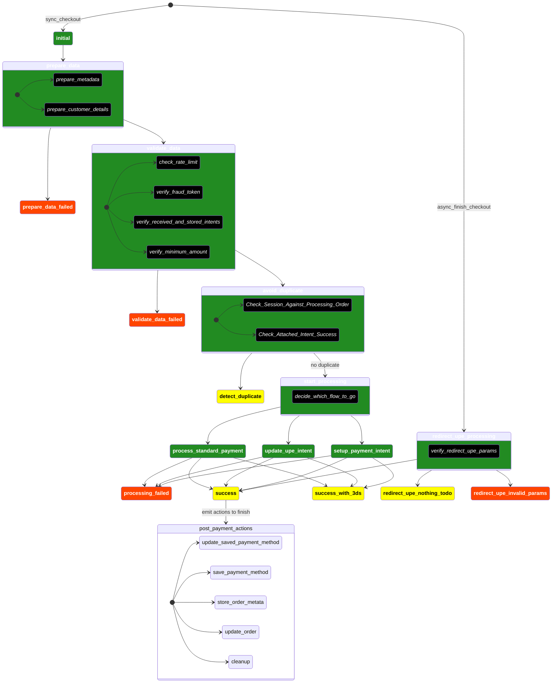

Syntax: https://mermaid.js.org/syntax/stateDiagram.html

See a better visualization and more up-to-date version at https://excalidraw.com/#json=JwZ2GsZgG4Jm1Wyx-ASc_,X6eXxqskkufGdmtppPxqOw

## Mermaid Diagram for Payment Processing States

Notes: 

- green background: happy state.
- red background: failure state.
- yellow background: happy state but the final state, i.e. ready to relay some information to the user or another system.

