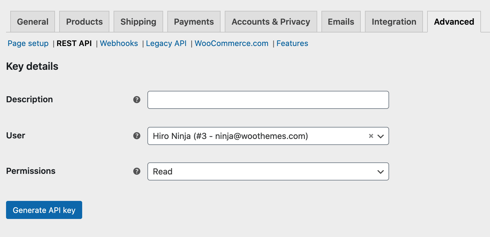
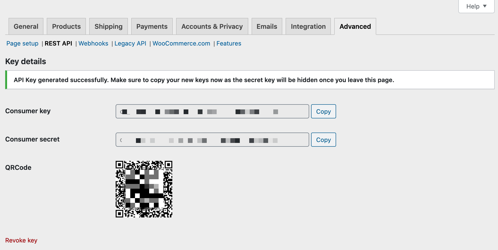

# Authentication

WooCommerce includes two ways to authenticate with the WP REST API. It is also possible to authenticate using any [WP REST API authentication](http://v3.wp-api.org/guide/authentication/) plugin or method.

Refer to the [WooCommerce REST API docs](http://woocommerce.github.io/woocommerce-rest-api-docs/#authentication) for more options and possibilities.

---

Pre-generated keys can be used to authenticate use of the REST API endpoints. New keys can be generated either through the WordPress admin interface or they can be auto-generated through an endpoint.

To create or manage keys for a specific WordPress user, go to WooCommerce > Settings > Advanced > REST API.

_Note: Keys/Apps was found at WooCommerce > Settings > API > Key/Apps prior to WooCommerce 3.4._

Click the "Add Key" button. In the next screen, add a description and select the WordPress user you would like to generate the key for. Use of the REST API with the generated keys will conform to that user's WordPress roles and capabilities.

Choose the level of access for this REST API key, which can be _Read_ access, _Write_ access or _Read/Write_ access. Then click the "Generate API Key" button and WooCommerce will generate REST API keys for the selected user.

Now that keys have been generated, you should see two new keys, a QRCode, and a Revoke API Key button. These two keys are your Consumer Key and Consumer Secret.

If the WordPress user associated with an API key is deleted, the API key will cease to function. API keys are not transferred to other users.
