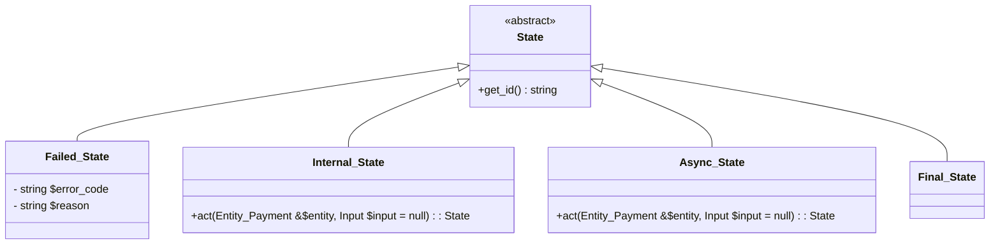
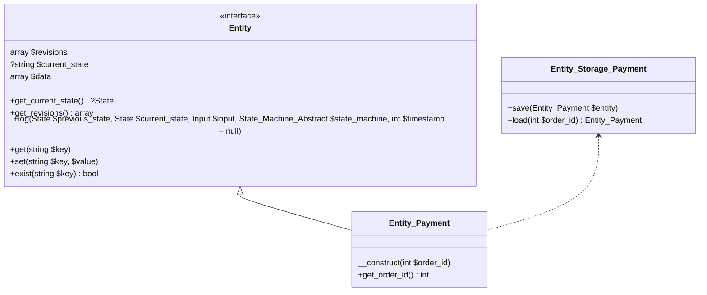
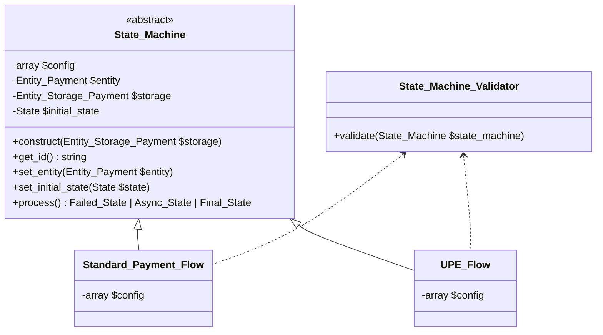

# State Machine

## Diagram 

### States: 

There are four types of states with different purposes: 

- Failed_State: any fail action will use this state.
- Internal_State: a state during the happy path, and it's expected to have the next state.
- Async_State: when reaching this state, the state machine will stop and relay information to UI. It will only continue when having more inputs from UI.
- Final_State: the last state of the state machine. It's expected to have no next state.

### Entity_Payment:

An entity is to let state machine interact with data via multiple states, save the current state and history changes. 

- $revisions: an array of changes of the entity including timestamp, previous state, current state, input, data diff before and after the transition.
- $current_state: the current state of the entity.
- set, get, exist: functions to interact with data.

The purpose of $revisions is to illustrate what has changed during the state machine process. It's useful for debugging and auditing.

### State Machine:

As illustrated in the diagram below, a state machine will have: 

- $config: declare the state machine's states and transitions.
- $entity: the entity that the state machine is working on.
- $storage: the storage of the entity after processing the state machine.
- $initial_state: the initial state of the state machine.

Before processing the state machine, the entity, initial state, and input must be set to the state machine. The initial state is optional, if not set, it will try using the current state saved in the entity and continue from there.
The secret sauce is in the `process` function: 

- It runs through actions of the current state, and get the next state.
- It verifies the next state is valid by checking the `$config`.
- It logs the current state and the diff of each transition to the entity, then save the entity.
- It keeps running until it reaches a non-internal state such as final state, an async state, or failed state.

Since we have a config, we can incorporate a validator to validate the config before processing the state machine in the development environment.

