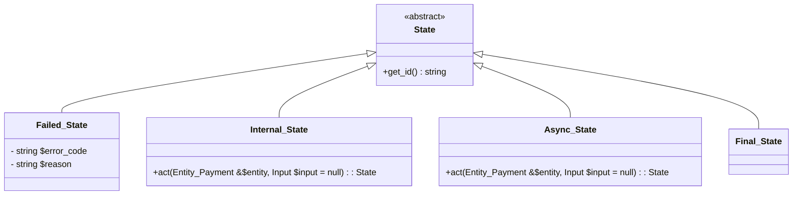
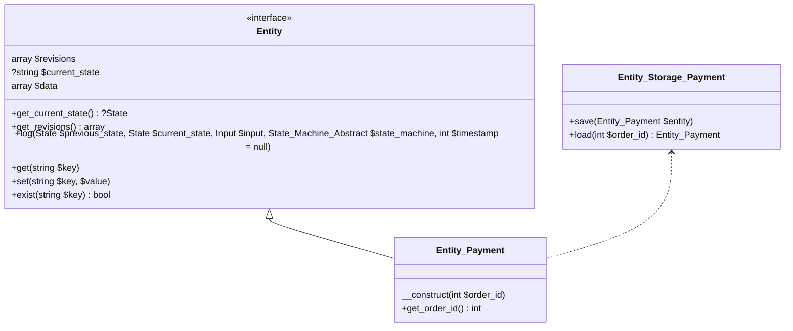
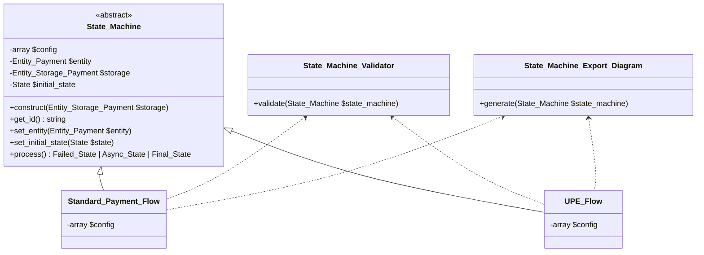

# State Machine

## States: 

There are four types of states with different purposes: 

- Failed_State: any fail action will use this state.
- Internal_State: a state during the happy path, and it's expected to have the next state.
- Async_State: when reaching this state, the state machine will stop and relay information to UI. It will only continue when having more inputs from UI.
- Final_State: the last state of the state machine. It's expected to have no next state.

Business logics will be added to the `act` function for Internal_State and Async_State that require next steps, and it must return the next State.



## Entity_Payment and Entity_Storage_Payment

An entity is to let state machine interact with data via multiple states, save the current state and history changes. 

- $revisions: an array of changes of the entity including timestamp, previous state, current state, input, data diff before and after the transition.
- $current_state: the current state of the entity.
- $diff_data: the diff of data before and after the transition.
- set, get, exist: functions to interact with data.
- log: after finishing the transition, log the relevant data (including $diff_data, previous state, next state, input, state machine, and timestamp) to the $revisions.

The purpose of $revisions is to illustrate what has changed during the state machine process. It's useful for retrospective debugging and auditing.




## State Machine:

### Diagram 



### Main class: 

As illustrated in the diagram above, a state machine will have: 

- $config: declare the state machine's states and transitions.
- $entity: the entity that the state machine is working on.
- $storage: the storage of the entity after processing the state machine.
- $initial_state: the initial state of the state machine.

Before processing the state machine, the entity, initial state, and input must be set to the state machine. The initial state is optional, if not set, it will try using the current state saved in the entity and continue from there.
The secret sauce is in the `process` function: 

- It runs through actions of the current state, and get the next state.
- It verifies the next state is valid by checking `$config`.
- It logs the current state and the diff of each transition to the entity, then save the entity.
- It keeps running until it reaches a non-internal state such as final state, an async state, or failed state.

### Validator

Since we have a config, we can incorporate a validator to validate the config before processing the state machine in the development environment: 
- Ensure that a Final_State must not have a next state.
- Ensure that an Async_State must have both incoming and outgoing transitions.
- Ensure that an Internal_State must have a next state.
- More advanced, with PHP 8.0 or above, we can use [the union return type](https://php.watch/versions/8.0/union-types) and [Reflection](https://www.php.net/manual/en/reflectionfunctionabstract.getreturntype.php), to check if developers to write State concrete classes with the expected returning state per the $config. 

E.g. this specific config: 

```php
  $config = [
		 Prepare_Data_State::class => [
			 General_Failed_State::class,
			 Validate_Data_State::class
		 ],
  ];
```

They will need to write the `act` method in `Prepare_Data_State` to return `Validate_Data_State` or `General_Failed_State` only:

```php
class Prepare_Data_State extends Internal_State {
  public function act( Entity_Payment &$entity, Input $input = null ): Validate_Data_State | General_Failed_State {
    try {
        // do something
        return new Validate_Data_State();
    } catch ( Exception $e ) {
      return new General_Failed_State();
    }
  }
}
```

- However, since we're still supporting backward to PHP 7.2, we can use Psalm and [write a small plugin](https://psalm.dev/docs/running_psalm/plugins/authoring_plugins/) for `AfterMethodCallAnalysisInterface` to do a similar check.

### Export state diagram based on the config. 

As we have a limit set of states and their transitions, we can use the $config to generate a state diagram that has multiple benefits: 

- Anyone can understand states and their transitions without having a look at their implementations, i.e. reading code.
- Review the concept before making changes to the state machine.

We can also have a bit more advanced feature to export all relevant transitions from start to finish for a specific state. With that, it can reduce distractions by focusing on changes regarding that state. 


