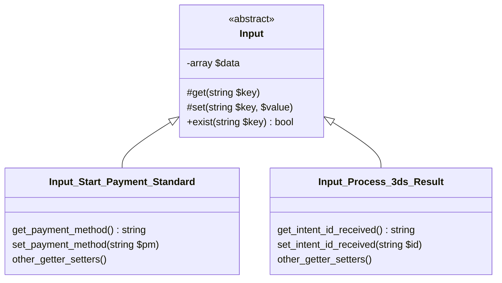
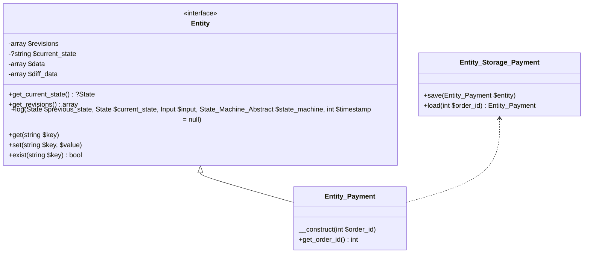
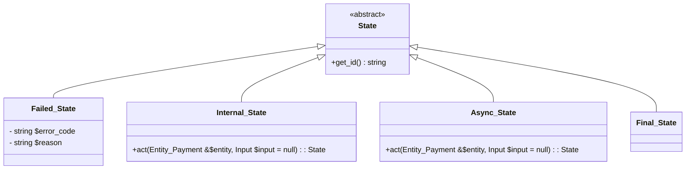
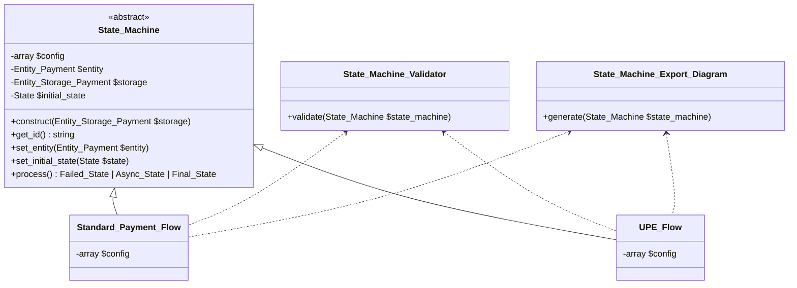

# State Machine Proposal 

This proposal would have these characteristics:

- Log entity data changes between states, input, and timestamp.
- Generate a diagram of the state machine based on the configuration, which is like a blueprint.
- Enforce developers to follow the configuration set by themselves.
- Terminate the state machine at a point (async state) and continue when having more inputs.

## Input 
Input is simply a DTO abstract class. It serves two purposes:

- Ensure a standard way to pass data to the state machine.
- Each of its concrete classes represents a type of input and at a different points. This requires developers to be more specific about the input type and the starting point before processing in the state machine.

For example, in two input classes in the diagram below, one is used for initiating a payment, and the other is used for processing 3DS result.



## Entity_Payment and Entity_Storage_Payment

An entity is to let state machine interact with data via multiple states, save the current state and history changes.

- $revisions: an array of changes of the entity including timestamp, previous state, current state, input, data diff before and after the transition.
- $current_state: the current state of the entity.
- $diff_data: the diff of data before and after the transition.
- set, get, exist: functions to interact with data.
- log: after finishing the transition, log the relevant data (including $diff_data, previous state, next state, input, state machine, and timestamp) to the $revisions.

The purpose of $revisions is to illustrate what has changed during the state machine process. It's useful for retrospective debugging and auditing.



## States

There are four types of states with different purposes: 

- Failed_State: any fail action will use this state.
- Internal_State: a state during the happy path, and it's expected to have the next state.
- Async_State: when reaching this state, the state machine will stop and relay information to UI. It will only continue when having more inputs from UI.
- Final_State: the last state of the state machine. It's expected to have no next state.

Business logics will be executed to the `act` function for Internal_State and Async_State based on two parameters an $entity and an $input, and it must return the next State. If needed, each state can inject relevant services to `act` on them. 



## State Machine:

### Diagram 



### Main class: 

As illustrated in the diagram above, a state machine will have: 

- $config: declare the state machine's states and transitions.
- $entity: the entity that the state machine is working on.
- $storage: the storage of the entity after processing the state machine.
- $initial_state: the initial state of the state machine.

Before processing the state machine, the entity, initial state, and input must be set to the state machine. The initial state is optional, if not set, it will try using the current state saved in the entity and continue from there.
The secret sauce is in [the `process` method](https://github.com/Automattic/woocommerce-payments/blob/5141de5079ddaea6551170f82e9d13b9f6e91d3e/includes/core/state-machine/class-state-machine-abstract.php#L57-L88): 

- It runs through actions of the current state, and get the next state.
- It verifies the next state is valid by checking `$config`.
- It logs the current state and the diff of each transition to the entity, then save the entity.
- It keeps running until it reaches a non-internal state such as final state, an async state, or failed state.

### Validator

Since we have a config, we can incorporate a validator to validate the config before processing the state machine in the development environment: 
- Ensure that each element of $config is a valid State class.
- Ensure that a Final_State must not have a next state.
- Ensure that an Async_State must have both incoming and outgoing transitions.
- Ensure that an Internal_State must have a next state.
- More advanced, with PHP 8.0 or above, we can use [the union return type](https://php.watch/versions/8.0/union-types) and [Reflection](https://www.php.net/manual/en/reflectionfunctionabstract.getreturntype.php), to check if developers to write State concrete classes with the expected returning state per the $config. 

E.g. this specific config: 

```php
  $config = [
		 Prepare_Data_State::class => [
			 General_Failed_State::class,
			 Validate_Data_State::class
		 ],
  ];
```

They will need to write the `act` method in `Prepare_Data_State` to return `Validate_Data_State` or `General_Failed_State` only:

```php
class Prepare_Data_State extends Internal_State {
  public function act( Entity_Payment &$entity, Input $input = null ): Validate_Data_State | General_Failed_State {
    try {
        // do something
        return new Validate_Data_State();
    } catch ( Exception $e ) {
      return new General_Failed_State();
    }
  }
}
```

- However, since we're still supporting backward to PHP 7.2, we can use Psalm and [write a small plugin](https://psalm.dev/docs/running_psalm/plugins/authoring_plugins/) for `AfterMethodCallAnalysisInterface` to do a similar check.

### Export state diagram based on the config. 

As we have a limit set of states and their transitions, we can use the $config to generate a state diagram that has multiple benefits: 

- Anyone can understand states and their transitions without having a look at their implementations, i.e. reading code.
- Review the concept before making changes to the state machine.

We can also have a bit more advanced feature to export all relevant transitions from start to finish for a specific state. With that, it can reduce distractions by focusing on changes regarding that state. 

## Q&A 

### 1, As we have many flows that share states, how can we reuse the code?

Yes, they can declare the shared parts and then merge them together when declaring a new concrete State_Machine class.

E.g.

```php

const SHARED_CONFIG = [
  Prepare_Data_State::class => [
    General_Failed_State::class,
    Validate_Data_State::class
  ],
];

class Standard_Payment_Flow extends State_Machine_Abstract {
  protected $config;
  public function __construct( Entity_Storage_Payment $storage ) {
    parent::__construct( $storage );
    $this->config = array_merge( 
        Start_Standard_Payment_State::class => [ Prepare_Data_State::class ],
        SHARED_CONFIG,
    );
  }
}

class UPE_Payment_Flow extends State_Machine_Abstract {
  protected $config;
  public function __construct( Entity_Storage_Payment $storage ) {
    parent::__construct( $storage );
    $this->config = array_merge( 
        Start_UPE_Payment_State::class => [ Prepare_Data_State::class ],
        SHARED_CONFIG,
    );
  }
}
```
### 2, How to add or modify a state? 

Steps: 

- Add it to the $config of State_Machine concrete classes.
- Review the state diagram to ensure that the new state is in the right place.
- Implement a concrete class extending from one of four `State` types for that new state.

### 3, How to trigger a state machine?

See more in the [`Standard_Gateway_Example`](https://github.com/Automattic/woocommerce-payments/blob/poc/state-pattern-regineering-payment-process/includes/core/state-machine/class-gateway-example.php) class.

Basically, you will need to clarify inputs and entiy, and then process all of these via State_Machine, and handle the result of this process. 

```php
		// Load the payment entity based on the order.
		$payment_storage = new Entity_Storage_Payment();
		$payment_entity = $payment_storage->load( $order );

		// Build up input object from the HTTP request.
		$input = new Input_Start_Payment_Standard();
		$input->set_payment_method( wp_unslash( $_POST['payment_method'] ?? '' ) );
		// ... Many more inputs here.

		// Set required variables for the state machine, and progress.
		$state_machine = new State_Machine_Standard_Payment( $payment_storage );
		$state_machine->set_initial_state( new Start_Standard_Payment_State() )
			->set_entity( $payment_entity )
			->set_input( $input );
		$processed_entity = $state_machine->process();

		// current_state at this point can be either:
		// - failed state: General_Failed_State
		// - async state: Need_3ds_State
		// - final states: Completed_State, Completed_Duplicate_State
		$current_state = $processed_entity->get_current_state();
```
