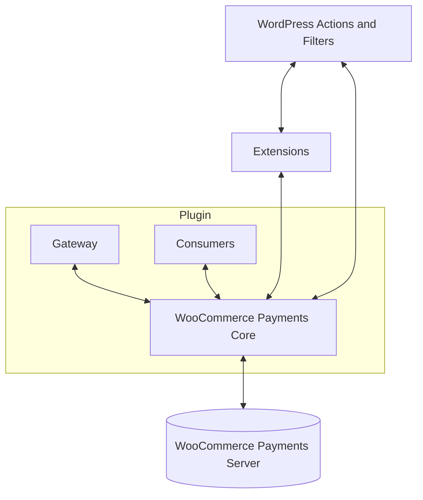

# WooCommerce Payments Core API

This directory contains core WooCommerce Payments functionality, officially available for both internal use, and use by consumers and extensions.

> 🔗 If you are contributing to WooCommerce Payments, please refer to [the core contributing guidelines](CONTRIBUTING.md).

## Definition

The funtionality within this directory is meant to be expanded and maintained in a stable and reliable way, which will provide a solid base for building on top of and within WooCommerce Payments.

Here is difference between the core and the rest of the plugin:



1. __WooCommerce Payments Core__ is a set of classes (and APIs), which (should) contain core WooCommerce Payments functionality like the connection to the server, main services (like [the customer service](service/customer-service.md)), and etc.
2. The rest of the __gateway__, meaning separate pieces of functionality like the REST API, admin views, etc.
3. __Consumers__ are pieces of code, which are tightly connected to WooCommerce Payments, but are not crutial to its core functionality. Examples include Multi-Currency, WooPay, and other extensions, some of which are built into WooCommerce Payments.
4. __Extensions__ are those use-cases, which are linked to WooCommerce Payments, but not build on top of/within the plugin. Those should use *WordPress actions and filters* to integrate with the gateway, and connect with the plugin through the classes, contained within the plugin core.

## Support and backwards compatibility

The core is developed, and will be maintained with backwards compatibility in mind.

⚠️ This means that everything outside of this directory should be considered internal for the plugin, and may be changed without consideration for notice.

To ensure stability and resilience, please avoid using non-core classes and methods within your extensions. The plugin is under active development, and if you need something, which is not present in this directory, please [open an issue](https://github.com/Automattic/woocommerce-payments/issues/new/). We will always consider the best way to expose the needed functionality.

## Available functionality

WooCommerce Payments Core is under active development, and currently includes the APIs, listed below.

### Gateway Mode

This is a singular `WCPay\Core\Mode` object, accessible through `WC_Payments::mode()`. It allows you to check whether the gateway is in any of the listed modes, as well as to force it into one of them:

| Mode     | Check      | Setter   | Description                           |
|----------|------------|----------|---------------------------------------|
| __Live__ | `is_live()`| `live()` | Standard working mode of the gateway. |
| __Test__ | `is_test()`| `test()` | Allows test mode on live accounts.    |
| __Dev__  | `is_dev()` | `dev()`  | Allows test accounts to be created.   |

During initialization, the following logic is used:

1. Sandbox mode would be entered if:
    - Either [WordPress's environment type](https://developer.wordpress.org/reference/functions/wp_get_environment_type/#description) is either `development` or 		`staging`.
    - or `WCPAY_DEV_MODE` is defined and set to boolean true.
2. Test mode is entered if:
    - Either Sandbox mode is already enabled.
    - or the gateway's test mode setting is on.
3. If the gateway is neither in sandbox or test mode, live mode is entered.

To alter this behavior, you can use the `wcpay_dev_mode` and `wcpay_test_mode` filters, for example:

```php
add_filter( 'wcpay_dev_mode', '__return_true' );
```

This is done on the `init` action.

> 🎗️ The object is not accessible before the `init` WordPress action.

Once the mode has been initialized, the gateway will work in that mode. The setters (from the table above) may be used to switch the working mode during runtime, but it should be done with caution, as other functionality may already be initialized in the main mode, hence it is recommended to switch back once done.

__Checking the current mode:__

```php
// Check for live mode:
WC_Payments::mode()->is_live();

// Check for test mode:
WC_Payments::mode()->is_test();

// Check for dev mode:
WC_Payments::mode()->is_dev();
```

### Services

WooCommerce Payments contains a comprehensive set of internal services, but as explained at the beginning of this document, they are subject to change without notice.

Instead, please use the following services available in core:

- [🔗 `WC_Payments_Customer_Service_API`](service/customer-service.md)

### Server requests & responses

Communication with the WooCommerce Payments Server is currently done through a mix of the `WC_Payments_API_Client`, and request classes, and being migrated to fully use the latter.

🔗 [Read the full docs for server communication here](server/README.md).
